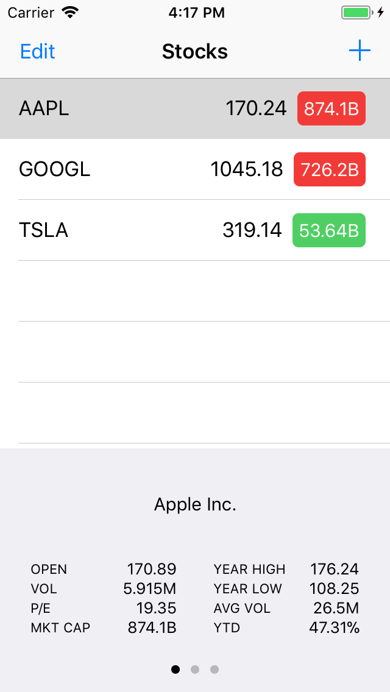
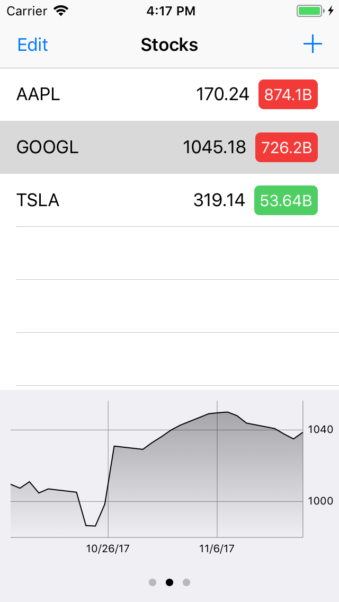
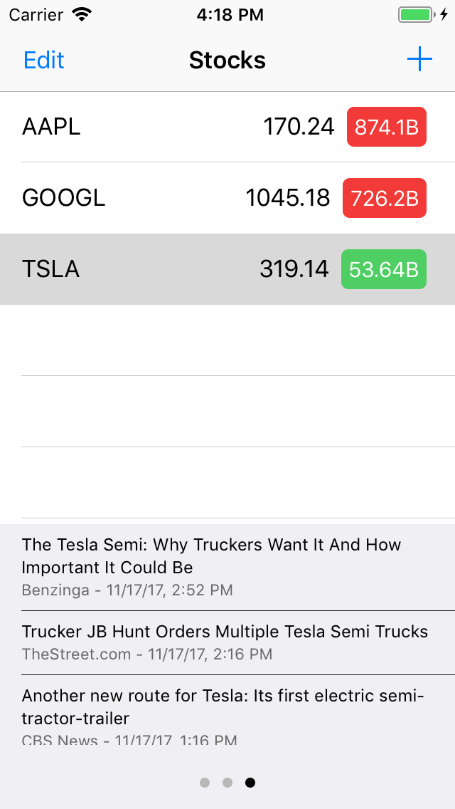
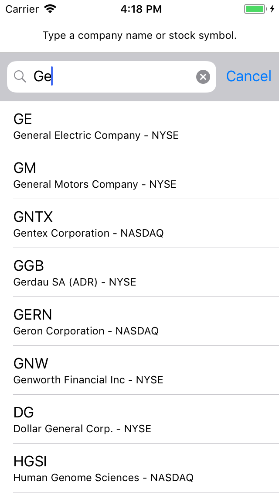

# Stocks
This is my first iOS app, it’s a clone of the Stocks app by Apple. It’s just a learning project.

## Improvement ideas

- Add testing using XCTest.
- Add today widget.
- Support landscape orientation and iPads (using size classes).

## Requirements
- iOS 10.0+
- Xcode 9.0+
